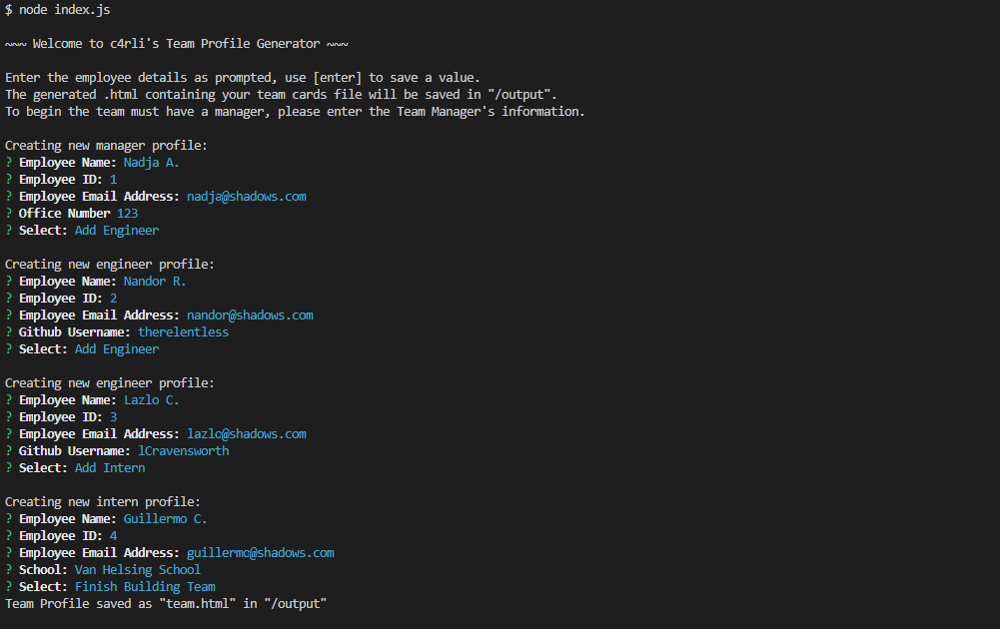

# Team Profiles Generator
CLI program to generate .html files containing team members. Powered using node.js and inquirer.

## Description
This is a simple command line interface (CLI) app that runs on your terminal to dynamically generate a Bootstrap html page containing cards of the members of a team displayed on a single page. 

### My User Story:
```
AS A manager
I WANT to generate a webpage that displays my team's basic info
SO THAT I have quick access to their emails and GitHub profiles
```

### Features:
- Generates complete Bootstrap HTML webpage.
- Creates functional Github and email links at bottom of cards.
- Questions are customizable and design is modular for ease of updating.

### CLI View:

### Preview of HTML generated:


## Installation
The user will need to download this repo and have node.js installed as well as the inquirer package using `npm i inquirer`<br>

## Usage
The user enters the name of their team manager first when prompted in the terminal, they will then be given the option to add as many engineers and interns as required. Once complete the program will generate a completed html page in the output folder.

## Credits
Source code written by carli n. aka c4rli ++

## License

